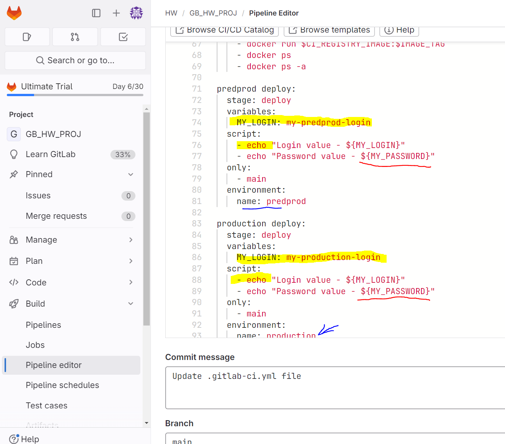
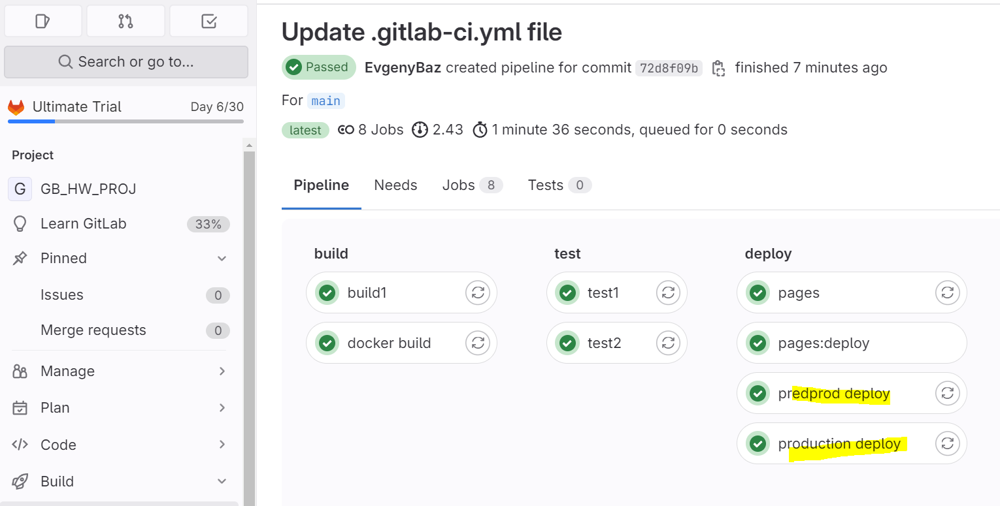
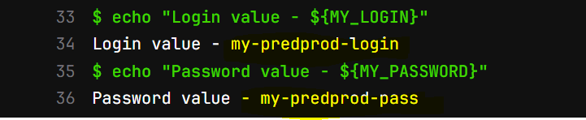
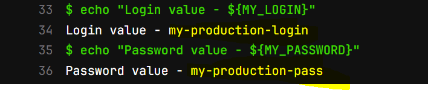

добывлены две jobs : preprod deploy и production deploy
созданы переменные MY_LOGIN с разными значениями.

В настройках гитлаба (Настройки -> CI/CD -> Variables) создны две переменные MY_PASSWORD
под разные среды - preprod и production с разными значениями.

все этапы пройдены 

Результат выполнения preprod deploy

Результат выполнения production deploy

